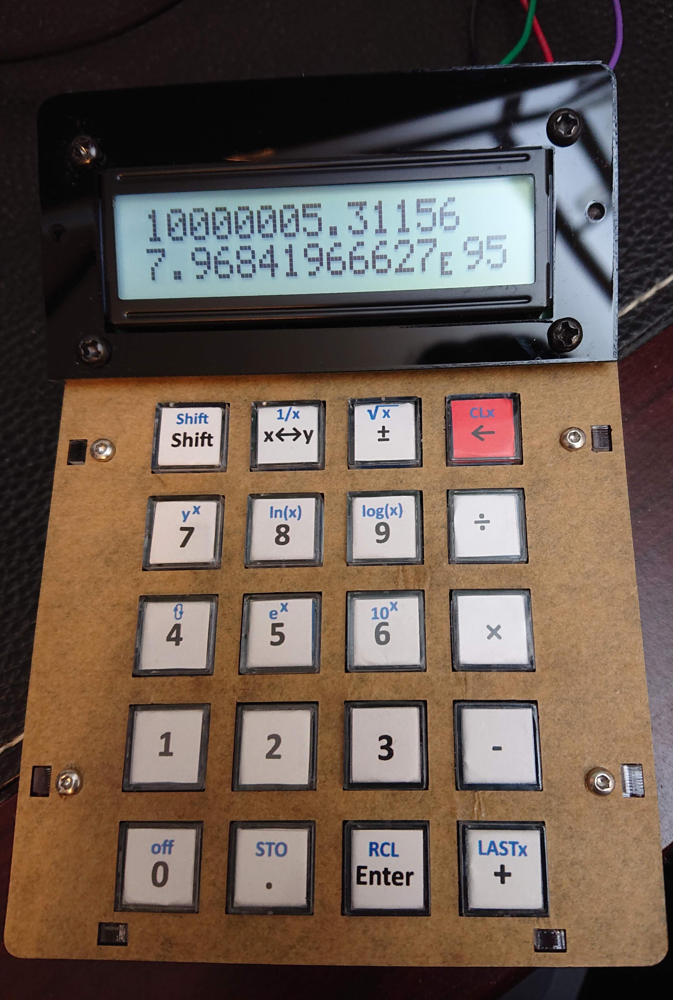
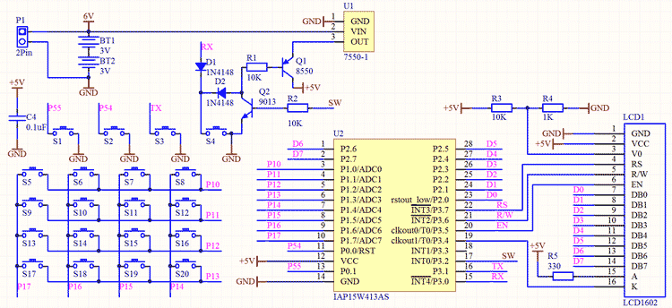
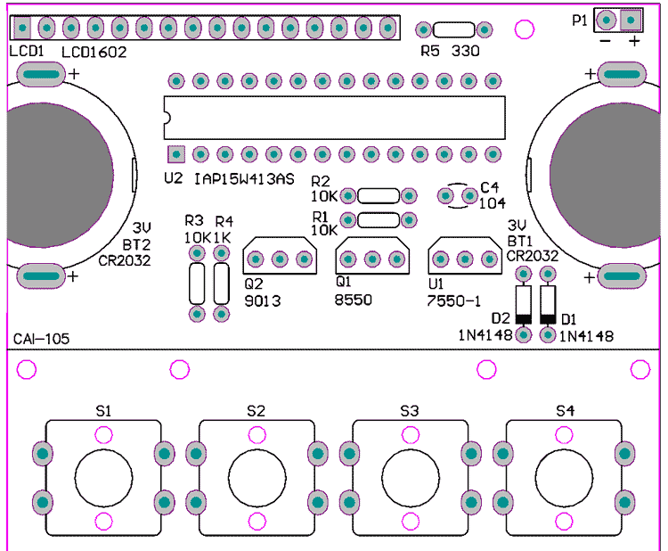

# STC DIY Calculator Firmware

This is a replacement firmware for the [diyleyuan calculator](http://www.diyleyuan.com/jc/L8Q.html). The calculator is available for purchase for less than $13 shipped from eBay by searching for "diy calculator kit". The calculator uses an STC IAP15W413AS microcontroller (an 8051 instruction set-compatible microcontorller) with a built in serial bootloder. This project uses SDCC to compile the C code and [stcgal](https://github.com/grigorig/stcgal) to load the new firmware.

# Building
- The Makefile can be used for building the project to calculator.
	- type `make` to build
	- (you must already have SDCC installed and setup so it can be found in your PATH)
	- this will create a `main.hex` output file
	- there is also a prebuilt binary checked in at `binaries/main.hex`
- CMakeLists.txt is for building the Qt desktop application.
	- (still a work in progress, currently doesn't do anything)

# Installing
The STC microcontroller used has a bootloader permanently stored in ROM that allows downloading new firmware over a serial port. You can re-program it using a USB-to-logic-level-serial (5V) dongle, and the stcgal program. WARNING: a lot of USB-to-logic-level-serial dongles are for 3.3V logic levels. The diyleyuan calculator runs at 5V to make it easier to power/drive the LCD display. You have a couple of options:

1. Buy a USB to logic level serial dongle that supports 5V operation (these dongles may have a jumper you need to set to switch between 3.3V and 5V). This is the best option.
	- Here is one that works: https://www.amazon.com/gp/product/B00N4MCS1A/
1. If you have an adjustable power supply, power the diyleyuan calculator at 3.3-3.5V for programming, instead of 5V, and use a 3.3V USB to logic level serial dongle.
	- You won't be able to see the LCD screen at 3.3V well, though.
	- After programming, remove the USB dongle, and set the voltage back up to 5V to make the LCD readable.
	- This is an ok option, but is cumbersome to switch between 3.3V and 5V, and requires that you have an adjustable power supply.
	- Also you run the risk of forgetting to switch between the 2 voltages.
1. Run the calculator at 5V, and use a 3.3V USB dongle anyways.
	- NOT RECOMMENDED, don't do this
	- this violates the absolute maximum ratings for most of these USB to 3.3V logic level dongles, and may damage either the dongle or your computer.

## Hardware connections
- Pin 15 of the STC microcontroller is RX to the microcontroller (green wire in the picture).
- Pin 16 is TX from the microcontroller (purple wire in the picture).

You must "cross over" TX/RX going between the microcontroller and the USB dongle (i.e. RX on the microcontroller goes to TX on the USB dongle, and TX on the microcontroller goes to RX on the USB dongle). You must also connect ground to the dongle. A good point ot use is either pin 1 of U1, or the header P1.

Be careful when working on the calculator. The 7550 voltage regulator used has no short circuit protection. It does have a very low quiescent current and low dropout voltage though, and you must match the low dropout voltage if replacing the regulator. If you do end up damaging the regulator (like I did), a good replacement is the Microchip MCP1700-5002E/TO. In the picture, I have removed the 7550, shorted pins 2 and 3, and added a capacitor between pin 1 and pins 2/3. I am powering the calculator externally, instead of with batteries.

Here is the schematic from the diyleyuan website. Note that the schematic symbol for the microcontroller mistakenly labels P5.4 as P0.0, and mistakenly labels P5.5 as P0.1. The net name labels are correct.

The soft-latching power switch works as follows: Initially the calculator is off. Both Q1 and Q2 are off. Pressing the On key (S4) turns on Q1 through R1 and D2. Q1 then supplies 5V to the system. Once the microcontroller has power and starts running, it turns on Q2, which keeps Q1 on through R1. To turn off, the microcontroller turns off Q2, which in turn will turn off Q1.

Here is the component layout from the diyleyuan website.

The switches used are a knockoff of the Omron B3F series. A good replacement is the B3F-5050 (the switches included take quite a bit of force to depress). The LCD used is a fairly standard LCD based on a HD44780-compatible controller. The hole spacing for the screw holes on the LCD is 31mm x 75mm. There are many replacements available, including ones that don't need the backlight on to be readable. I recommend a postive FSTN type, although the one included is definitely usable.

## Programming with stcgal

See below for the stcgal output. Replace `stc_rpncalc/main.hex` with the actual path to the main.hex you built. In this example, I'm programming at a relatively high line rate of 230,400 bits/s. You may want to try at a slower speed 1st to get things working (omit the `-b 230400` option).

~~~~
$ ./stcgal.py -P stc15 -b 230400 stc_rpncalc/main.hex
Waiting for MCU, please cycle power: done
Target model:
  Name: IAP15W413AS
  Magic: F562
  Code flash: 13.0 KB
  EEPROM flash: 0.0 KB
Target frequency: 11.567 MHz
Target BSL version: 7.2.5T
Target wakeup frequency: 37.261 KHz
Target options:
  reset_pin_enabled=False
  clock_source=internal
  clock_gain=high
  watchdog_por_enabled=False
  watchdog_stop_idle=True
  watchdog_prescale=256
  low_voltage_reset=True
  low_voltage_threshold=3
  eeprom_lvd_inhibit=True
  eeprom_erase_enabled=False
  bsl_pindetect_enabled=False
  por_reset_delay=long
  rstout_por_state=high
  uart2_passthrough=False
  uart2_pin_mode=normal
  cpu_core_voltage=unknown
Loading flash: 13307 bytes (Intel HEX)
Trimming frequency: 11.597 MHz
Switching to 230400 baud: done
Erasing flash: done
Writing flash: 13376 Bytes [00:03, 4046.93 Bytes/s]
Finishing write: done
Setting options: done
Target UID: F56201500C1752
Disconnected!
~~~~

(The name for `stcgal` is probably a play on words from the `avrdude` programming software used to program AVR microcontrollers.)

# Usage
## Calculation
The calculator uses RPN. To calculate (2+3)/(9^2), enter:

- 2
- Enter (=)
- 3
- `+`
- 9
- Enter (=)
- `*`
- `÷`

The = key is used for Enter. There is automatic stack lift so that `9`, `Enter`, `*` is equivalent to 9^2.

## Keys
The keys on the original calculator map as follows:

- `=   `: Enter
- `<-  `: Negate (+/-: change sign)
	- Note: for implementation simplicity, this is a postfix operator.
	- Pressing this key will immediately terminate digit entry and negate the number.
- `sqrt`: Swap `x <-> y`
- `.   `: ./(-)Exp: The `.` key works similarly to old Sinclair Scientific calculators that have a limited number of keys:
	- The 1st press inserts a decimal point.
	- The 2nd press begins exponent entry.
	- The 3rd and subsequent presses negates the current exponent being entered.
- `mode`: reserved for a future shift key

## Turning off
Hold `mode` and `0` at the same time to turn off. NOTE: There is no auto power off.

# Bugs
1. Currently, trying to display numbers between `[0.1, 1)` causes the calculator to crash.
1. There are other calculations which can randomly cause the calculator to crash.
1. There are probably more bugs waiting to be discovered.

# Internals
## Number Format
The original firmware that came with this calculator used a fixed point format, which significantly limited the range of numbers usable. Also, the implementation was slightly buggy (e.g. `3,162.277*3,162.28` gave `10,000,010` instead of the correct `10,000,005.31156`).

This calculator firmware uses decimal floating point, using base-100 to store numbers and do calculations. Base-100 allows for efficient storage into 8-bit bytes, and is easier to work with than packed-BCD. Unlike straight binary representations, base-100 is still fairly easy to display as decimal. Also unlike binary representations, there is no conversion error from binary/decimal (e.g. numbers like `0.1` can be represented exactly).

Each `uint8_t` stores a base-100 "`digit100`", referred to as an "`lsu`", for least significant unit (the terminology is borrowed from the decNumber library: I originally considered using the decNumber library similar to the WP-34S calculator, but just the library itself takes several times more flash than is available on this calculator). The number format is as follows:

- `lsu[0]`: contains the most signifcant `digit100` (the most signifcant 2 decimal digits)
	- implicit decimal point between `lsu[0]/10` and `lsu[0]%10`
- `lsu[1]` to `lsu[n-1]`: the resst of the array contains the next `digit100`s in order from most to least signifcant
- exponent: holds the exponent of the floating point number
	- stored directly in 2's complement binary
	- this is a base-10 exponent, not a base-100 exponent
		- allows all digits in the `lsu[]` array to be significant when normalized
		- otherwise numbers such as `1.35` would be stored as `lsu[0]=01`, `lsu[1]=35`, losing 1 digit of representation in `lsu[0]`
		- range of exponents only needs to be `+/-99`

For example, the number `13.5` is stored normalized (with no leading zeros in the representation) as follows:

- `lsu[0]`: 13
- `lsu[1]`: 50
- `lsu[2]` to `lsu[n-1]`: all zero
- exponent: 1

There is an implicit decimal point between the 1 and 3 in `lsu[0]`, so the number is 1.350 * 10^1, which is equivalent to 13.5. Similarly, the number 1.35 would be stored the exact same way, except now the exponent is 0.

## Arithmetic
- Addition is done the same way as it's done by hand, although in base-100 instead of decimal.
- Subtraction is similarly done similar to how it's done by hand, although with carries instead of borrows using the "equal additions" algorithm, and also in base-100.
- Multiplication is done the same way it's done by hand, although in base-100. Partial sums are added up and shifted after each digit, instead of waiting until the very end to sum up all partial sums (as is common when doing long multiplication by hand).
- Division is done using a fixed number of Newton-Raphson iterations.

## Rounding
Currently, to save code space, there is no rounding being done, and numbers are instead truncated.

# Implementation
This was my 1st time using an 8051 microcontroller. The architecture is a bit limiting for programming in C compared to more modern architectures -- even compared to other 8-bit microcontrollers such as the AVR. Most significantly, there is no stack-pointer-relative addressing, which makes C functions takes up a lot of code space, since they must emulate stack-pointer-relative addressing. Unfortunately, the microcontroller used only has 13K of code space. It's almost completely full just implementing a basic 4-function, decimal-floating-point calculator.

I've avoided relying on the functions being able to be reentrant, so that they do not depend on having a stack. Some "large" local variables are declared as static in functions to save on the code space needed to emulate a stack.

Another weird thing about the 8051 is that not all of the memory is addressed the same way. On this microcontorller, there are 512 bytes of ram total, of which:

- only 128 bytes can be addressed directly (or indirectly)
	- the start of this address space is also shared with general purpose registers, so you don't actually have the full 128 bytes
- (there are also 128 bytes of "special function registers" which can be addressed directly to set up the microcontroller and its peripherals)
- 128 bytes can be addressed only indirectly (used in this firmware for the stack)
- 256 bytes can be addressed as external memory
	- on the original 8051, this memory it would have actually been external, although on this microcontroller, the "external" ram is built in

Thus, there are special compiler directives to tell it where to place things in memory. (Even for a simple calculator, there isn't enough directly addressable memory (128 bytes) to store everything.)

Currently all of the code space is full, although there are ways to free some of it up. This would involve changing the code and build to not use `--stack-auto`. After doing so, it might be possible to add back in square root (using Newton-Raphson iterations), maybe logarithms/exponents (and thus arbitrary powers including square roots), and maybe if there's still space left, the original resistor value calculator and the decimal/hex converter.

# Licensing
This code is licensed under GPLv3.
